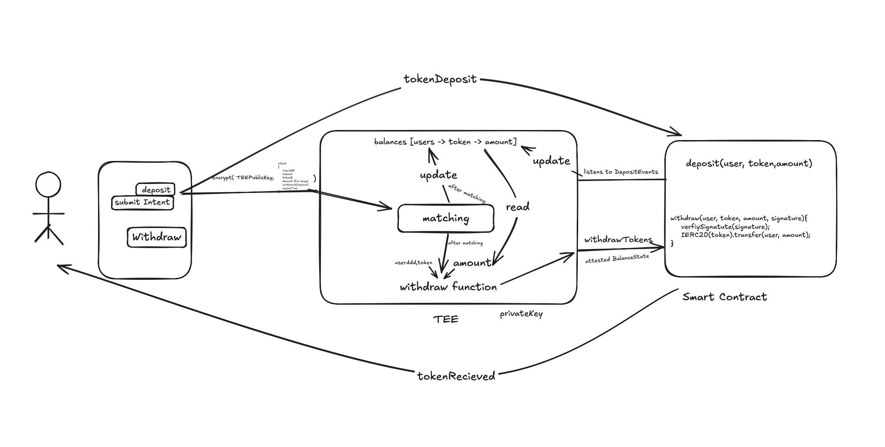

# SoloPatty – Fair Trade, No Sandwiching

**SoloPatty** is a trust-minimized, intent-based Decentralized Exchange (DEX) that leverages Trusted Execution Environments (TEE) to eliminate Miner Extractable Value (MEV) attacks, including frontrunning and sandwich attacks. By keeping all trade intents private and executing them securely, SoloPatty ensures a fair and efficient trading experience for DeFi users.

## Repository Structure
 We have 3 submodules
- The `hack` repository is the smart contract repository.
- The `ui` repository is the frontend repository.
- The `TEE` repository is the NestJS TEE repository.

## Key Features

- **No MEV Bots** 🛡️ – Private order flow prevents frontrunning and sandwich attacks.
- **Fair Order Execution** ⚖️ – Orders are batch-matched in a secure environment.
- **Lower Gas Fees** ⛽ – Efficient off-chain balance updates minimize on-chain costs.
- **Scalable & Secure** 🔒 – Utilizes cryptographic attestations for verifiable trade execution.

With SoloPatty, DeFi traders can execute transactions fairly, efficiently, and without MEV risks. 🚀

## How SoloPatty Is Built

SoloPatty integrates secure computing, encrypted trading, and blockchain smart contracts to create a decentralized trading experience without MEV risks.

### Tech Stack

#### Secure Execution & Order Matching

- **Marlin TEE + NestJS** – The backend operates within a Trusted Execution Environment (TEE) using NestJS, ensuring private and tamper-proof order matching.
  - Job ID: `0x0000000000000000000000000000000000000000000000000000000000000baa`
  - TEE IP Address: `43.204.7.164`

#### Smart Contracts

- **Solidity on Ethereum/Aptos** – Smart contracts handle:
  - Token deposits & withdrawals
  - Balance verification
  - Attestation signature verification

- **OpenZeppelin Libraries** – Utilized ERC20, ECDSA, and MessageHashUtils for secure token interactions and cryptographic verification.

#### Frontend & User Interaction

- **Next.js + Wagmi + Viem + ShadCN + TailwindCSS** – A modern frontend stack for fast and seamless Web3 interactions.

## 📜 Contracts Deployed

### 🍔 Patty Token
- **Address:** [`0x126F0c11F3e5EafE37AB143D4AA688429ef7DCB3`](https://sepolia.etherscan.io/address/0x126F0c11F3e5EafE37AB143D4AA688429ef7DCB3)
- **Description:** Core token in the SoloPatty system, representing the foundational layer of the patty structure.

### 🥬 Lettuce Token
- **Address:** [`0xF7aE103AacD84641Fa0c43860C23a8Cf7cE5DB5a`](https://sepolia.etherscan.io/address/0xF7aE103AacD84641Fa0c43860C23a8Cf7cE5DB5a)
- **Description:** Auxiliary token representing freshness or a feature enhancer — like lettuce in a burger analogy.

### 🧀 Cheese Token
- **Address:** [`0x5D7714751FAf22a96F7D2eAC15304839242cF8c0`](https://sepolia.etherscan.io/address/0x5D7714751FAf22a96F7D2eAC15304839242cF8c0)
- **Description:** Complementary token for added richness — cheese symbolizes premium features or additional value.

### 🔄 SoloPatty Contract
- **Address:** [`0xCB30D0881119bA8837A9e26E298d3b73c4c521EC`](https://sepolia.etherscan.io/address/0xCB30D0881119bA8837A9e26E298d3b73c4c521EC)
- **Description:** The orchestrator smart contract that interacts with Patty, Lettuce, and Cheese tokens to enable composability, swaps, or bundled logic within the SoloPatty ecosystem.

### How SoloPatty Works

1. **Users deposit tokens** → Smart contract locks funds and emits a deposit event.
2. **TEE listens** for deposit events and updates the off-chain balance state.
3. **Users submit encrypted trade intents** (signed & encrypted with the TEE's public key).
4. Every minute, the TEE:
   - Decrypts intents
   - Runs a Coincidence of Wants (CoW) matching algorithm
   - Updates the off-chain balance state
5. **Users withdraw tokens** → TEE generates an attestation signature, which the smart contract verifies before executing the transfer.

### Preventing MEV & Frontrunning

- **Encrypted Trade Intents** – No mempool exposure; bots cannot see pending orders.
- **Batch Matching in a TEE** – Ensures fair execution without sandwich attacks.
- **Attested Execution** – The TEE provides a cryptographic proof that orders were matched correctly.

### Hacky & Cool Innovations

- **Merkle Tree for Balance Compression** – Efficient off-chain balance management reduces gas fees.
- **TEE-Based Order Matching** – Ensures privacy & tamper-proof execution without trust assumptions.
- **Optimized Smart Contract Design** – Reduces unnecessary on-chain transactions, improving scalability.

With SoloPatty, decentralized trading is finally fair, private, and efficient—no more MEV, no more frontrunning. 🚀

## Repository Structure

This mono-repo consists of the following packages:

- **hack**: Contains the core smart contracts and blockchain interactions.
- **ui**: The frontend interface built with Next.js and integrated with Web3 tools for seamless user experience.
- **TEE**: The backend order-matching engine running within the Trusted Execution Environment (TEE).

Each package is maintained independently but works cohesively to power the SoloPatty DEX.

## Getting Started

To get started with SoloPatty, please refer to the individual READMEs in each package directory for setup instructions, dependencies, and usage guidelines.

## Contributing

We welcome contributions from the community! If you're interested in contributing to SoloPatty, please read our [Contributing Guidelines](CONTRIBUTING.md) and check out the open issues.

## License

This project is licensed under the MIT License. See the [LICENSE](LICENSE) file for details.

---

*Note: This project is under active development. Features and implementations are subject to change.*